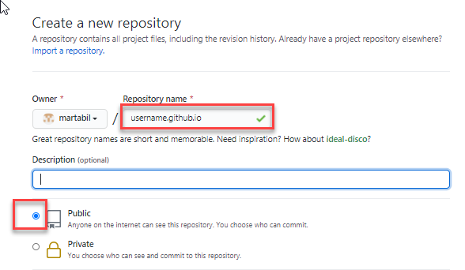
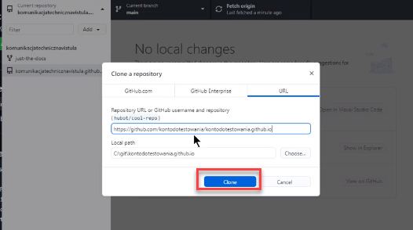
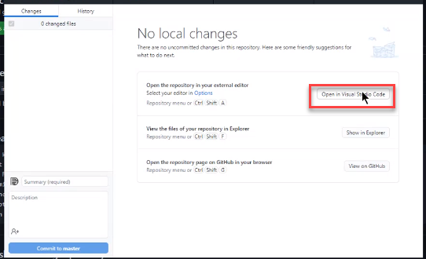
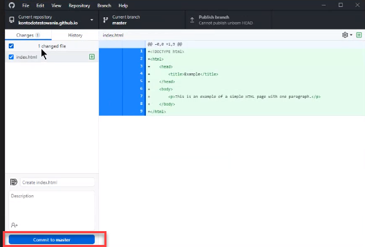

---

layout: default

title: Homework-GitHub Pages

nav_order: 5

---

**What are GitHub Pages**

**GitHub Pages** are public webpages hosted and easily published through GitHub. The quickest way to get up and running is by using the Jekyll Theme Chooser to load a pre-made theme. You can then modify your GitHub Pages’ content and style remotely via the web or locally on your computer.

**Quick user giude**
===

## How to create a website with GitHub Pages

1. Create a new repository
2. From your main profile page click **New** 

3. Give your repository special name username.github.io (where “username” is your actual GitHub user name)
   

Select **Public**
Click **Create repostitory**
Click **Set up in Desktop**
   

Clone repostitory

Open in Visual Studio Code

In the  folder create new file and name it **Index.html**. Find in the browser beginning of a code Hello World HTML and paste it into the file

 

Go to GitHub Desktop and click **Commit to master**

Click **Publish branch** 

