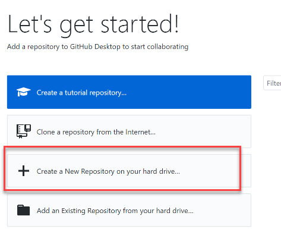
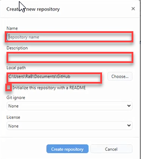
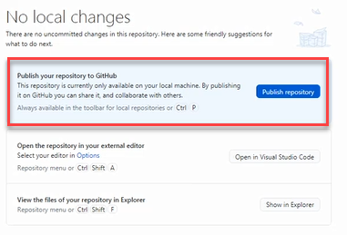
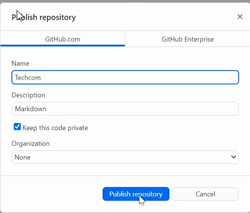
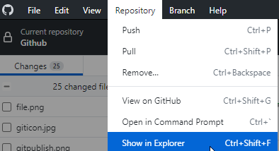
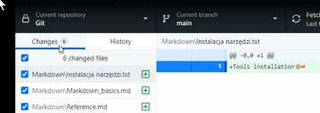
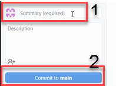

---

layout: default

title: Homework-GitHub

nav_order: 4

---

**What is GitHub?**

**GitHub** is a code hosting platform for version control and collaboration. It lets you and others work together on projects from anywhere.

To create account go to [GitHub](https://github.com/) and click Sign Up (if you don't have account) or Sign In
 (if you already had one)

 

 **What is Github Desktop**

 **GitHub Desktop** is an application that enables you to interact with GitHub using a GUI instead of the command line or a web browser. GitHub Desktop encourages you and your team to collaborate using best practices with Git and GitHub. You can use GitHub Desktop to complete most Git commands from your desktop with visual confirmation of changes. You can push to, pull from, and clone remote repositories with GitHub Desktop, and use collaborative tools such as attributing commits and creating pull requests.

 To download go to [Github Desktop](https://desktop.github.com/)

**Quick user guide**
===

## How to create a repository?

1. Click on a **+ Create a New Repository on your hard drive**

2. Fill in the fields

   

- *Name* - defines name of repository both locally and on GitHub
- *Description* - provides more infromation about repository
- *Path* - sets location of repository on computer

3. Select **Initialize this repository with a README**  
4. Click Create a repository

## How to publish your repository to GitHub

1. Click **Publish your repository to GitHub**

- *Name* and *Description* are automatically filled with information provided previously
1. Select **Keep this code private** to control who can view repository
2. Click **Publish repository**

## How to commit and push changes? 

1. In GitHub Desktop go to *Repository>Show in Exlorer*

2. In the folder add file/s locally on your computer
3. In GitHub Desktop go to Changes where you can see changes made in the file; checkmark indicates that the changes made to the file will be part of the commit 

4. In the lower left hand corner fill in the field *Summary* and then click **Commit to main** 

## How to share your repository with others 

1. Go to GitHub, in your repository go to *Settings>Mange access*
     
  

2. On the right click **Invite a collaborator**

3. Type in name of collaborator and click **Select a collaborator above** 

