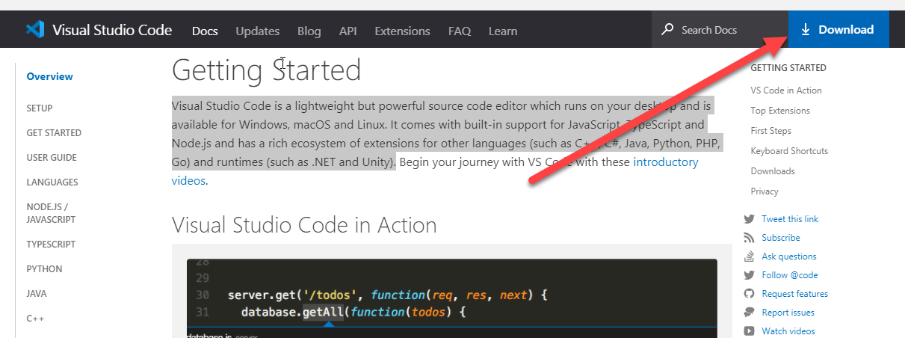
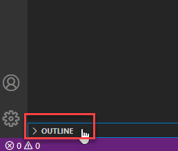
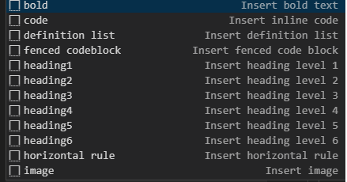
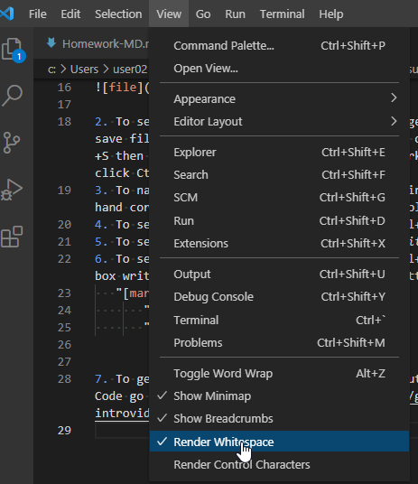
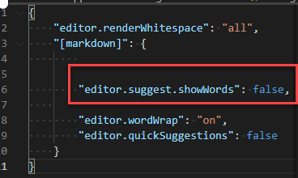
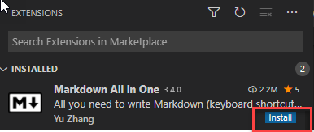

---

layout: default

title: Homework-Visual Studio Code

parent: Homework-Visual Studio Code

nav_order: 2

---

**What is Visual Studio Code?** 

**Visual Studio Code** is a lightweight but powerful source code editor which runs on your desktop and is available for Windows, macOS and Linux. It comes with built-in support for JavaScript, TypeScript and Node.js and has a rich ecosystem of extensions for other languages (such as C++, C#, Java, Python, PHP, Go) and runtimes (such as .NET and Unity).

**Quick user guide**

1. To download Visual Studio Code go to https://code.visualstudio.com/docs and click on Download in the upper right hand corner
    

2. To start writing go to *File > New File* (in the left upper hand corner)

3. To see preview that will show how text is generated into HTML save file as markdown. Go to *File > Save As* or click Ctrl+Shift+S then choose the location and extension: markdown. After that click Ctrl+K V 
4. To navigate within document go to OUTLINE in the lower left hand corner. You can find structure of the whole document there.  
   
  
5. To see a suggestion for command  click Ctrl+Space. After that below box appears. 
 

6. To see whitespaces go to *View > Render Whitespace*  
   
   

7. To see suggestion for formatting click Ctrl+Shift+P > in the box write Preferences > Configure language settings > Markdown  
On dropdown list find "editor.suggest.showWords" and change trur for false as marked below

8. To install helpful extension go to *View>Extensions* search for **Markdown All in One** and click Install

9.  To get more information and learn more about Visual Studio Code go to [introvideos](https://code.visualstudio.com/docs/getstarted/introvideos)
